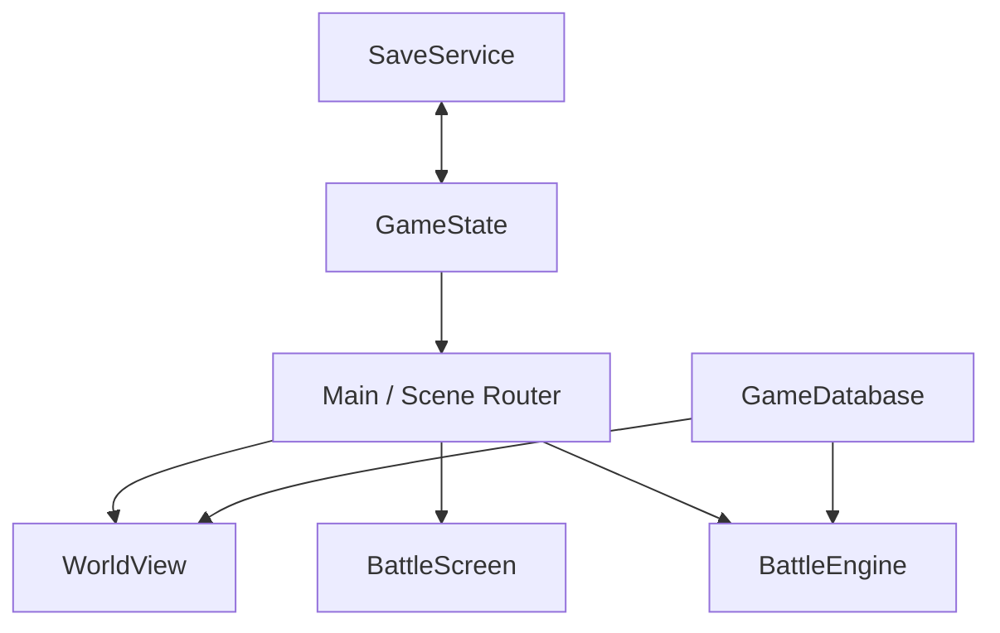

# アーキテクチャ

## 方針

ゲーム定義、実行状態、画面表示を分離し、セーブデータや戦闘ロジックがUIの変更に引きずられない構成にしています。

## 責務

| 要素 | 責務 |
|---|---|
| `GameDatabase` | マップ、敵、呪文、道具、装備の変更されない定義 |
| `GameState` | 主人公、所持品、装備、進行フラグ、現在地の変更される状態 |
| `SaveService` | バージョン付きJSONと3スロットの読み書き |
| `BattleEngine` | UI非依存の行動解決、ダメージ、勝敗、報酬 |
| `WorldView` | グリッド移動、当たり判定、描画、出口、エンカウント |
| `Main` | 画面遷移、イベント実行、クエスト進行の調停 |
| `ui/*` | 入力と表示。ゲームルールは持たない |

Autoloadは`GameState`だけです。画面同士は直接参照せず、`Main`がSignalを受けて遷移します。

## セーブ互換性

保存対象はResourceパスではなく、`town`、`slime`、`iron_sword`のような安定IDです。トップレベルと状態本体の双方にバージョンを持たせ、将来は`SaveService`でマイグレーションを追加できます。

## 依存関係

実行時の外部アドオンはありません。MVPでは小さなヘッドレステストを同梱し、プロジェクトが成長した段階でGUT 9.7.1へ移行できるよう、`BattleEngine`と`GameState`をシーン非依存にしています。

## 拡張ポイント

- `GameDatabase`を`.tres`定義へ移行する。
- `Main`内のイベント分岐をEvent Command Resourceへ移す。
- 敵グループと複数人パーティーを`BattleEngine`へ追加する。
- セーブスキーマ更新時にバージョン別マイグレーションを追加する。
- 画像素材を追加しても、`WorldView`と`EnemyPortrait`の表示層だけを交換する。

