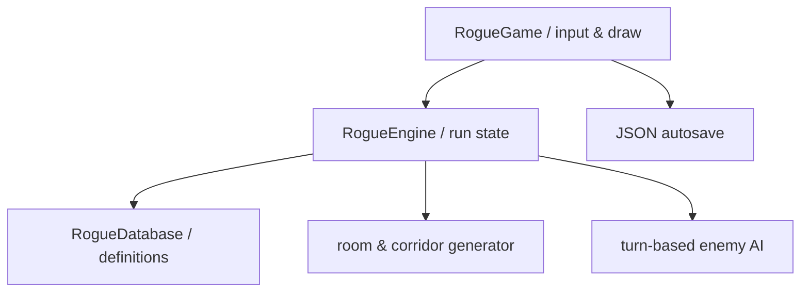

# アーキテクチャ

## 構成

| 要素 | 責務 |
|---|---|
| `RogueDatabase` | 敵、戦利品、装備、薬の固定定義と生成規則 |
| `RogueEngine` | マップ生成、視界、ターン解決、敵AI、戦闘、空腹、所持品、セーブ形式 |
| `RogueGame` | キーボード・マウス・タッチ入力、ピクセル描画、画面遷移、自動保存 |

`RogueEngine`はシーンに依存しない`RefCounted`で、同じseedから同じ地形を作れます。UIなしのテストで複数seedのマップ到達可能性とゲーム規則を検証します。

## セーブ

進行中の探索は`user://deep_ruins_run.json`へ毎ターン保存します。死亡または帰還時に削除され、挑戦回数、帰還回数、最深階、最高スコアだけを`user://deep_ruins_meta.json`へ残します。

Web版ではこれらがブラウザー端末内へ保存されます。保存形式は`schema: 2`を持ち、座標と色をJSON互換値へ変換します。

## ライセンス境界

Shattered Pixel DungeonのGPLコード、画像、音声、文章、固有名称は含みません。参考にしたのはジャンル上のゲーム設計のみです。

